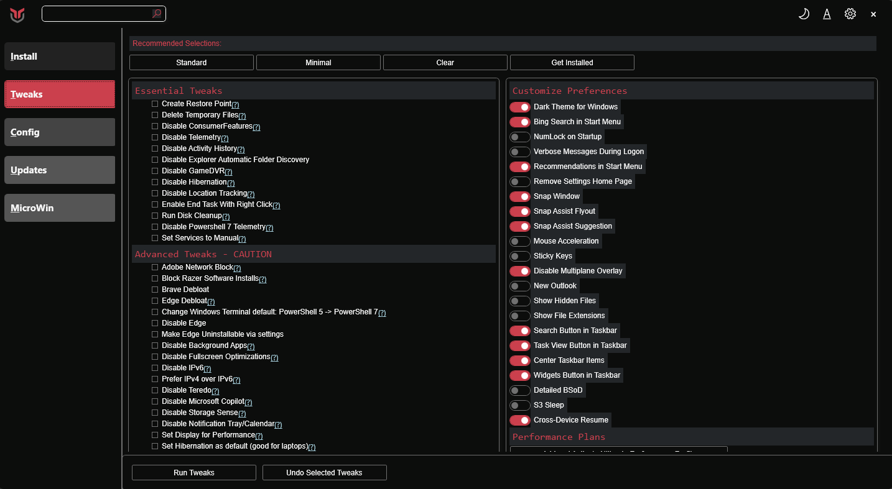

# EXM - Windows Utility Tool

**Developed by Anyxx DEV**

EXM is a powerful Windows utility tool for managing and customizing your Windows system. It streamlines *installs*, debloat with *tweaks*, troubleshoot with *config*, and fix Windows *updates*.



## 💡 Usage

EXM must be run in Admin mode because it performs system-wide tweaks. To achieve this, run PowerShell as an administrator. Here are a few ways to do it:

1. **Start menu Method:**
   - Right-click on the start menu.
   - Choose "Windows PowerShell (Admin)" (for Windows 10) or "Terminal (Admin)" (for Windows 11).

2. **Search and Launch Method:**
   - Press the Windows key.
   - Type "PowerShell" or "Terminal" (for Windows 11).
   - Press `Ctrl + Shift + Enter` or Right-click and choose "Run as administrator" to launch it with administrator privileges.

### Launch Command

To run EXM, compile the project and execute:

```ps1
.\Compile.ps1
.\exm.ps1
```

## 🎓 Documentation

EXM is based on the original WinUtil project. For more information about the original project, visit the [WinUtil Documentation](https://winutil.christitus.com/).

## 🛠️ Build & Develop

> [!NOTE]
> EXM is a relatively large script, so it's split into multiple files which're combined into a single `.ps1` file using a custom compiler. This makes maintaining the project a lot easier.

To build the project, run the Compile Script under a PowerShell window (admin permissions IS NOT required):
```ps1
.\Compile.ps1
```

You'll see a new file named `exm.ps1`, which's created by `Compile.ps1` script, now you can run it as admin and a new window will popup, enjoy your own compiled version of EXM :)

## 👨‍💻 Developer
- **Anyxx DEV** - Main Developer

## 💖 Support
- To support this project, make sure to leave a ⭐️!

## 📝 License

This project is based on the original WinUtil project. Please refer to the LICENSE file for more information.
